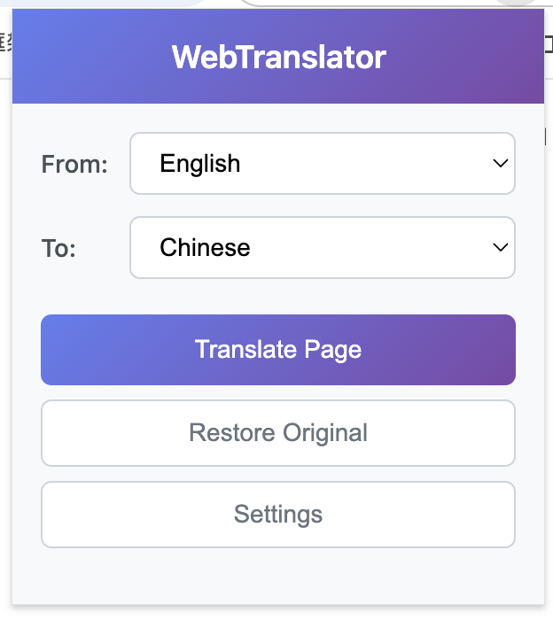
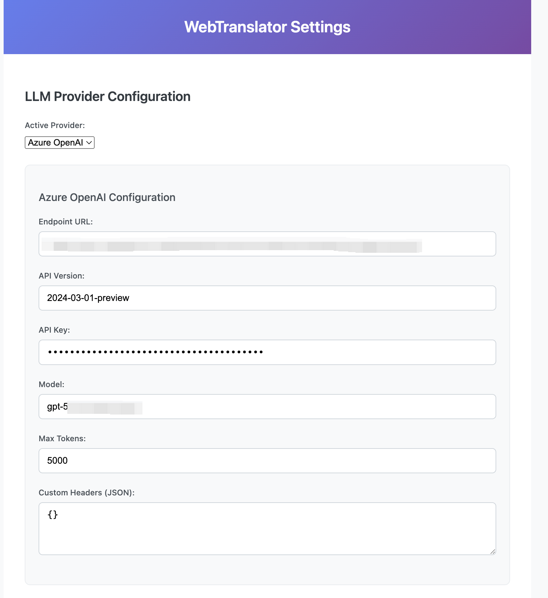
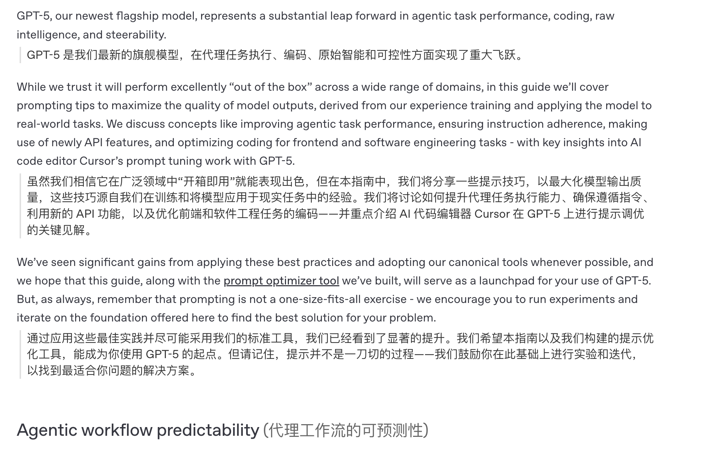

# WebTranslator

<div align="center">


**A powerful Chrome extension for real-time webpage translation using multiple LLM providers**

[](https://chrome.google.com/webstore)
[](https://github.com/bytedance/WebTranslator)
[](LICENSE)

[English](#english) | [中文](#中文)

</div>

## English

### Overview

WebTranslator is a Chrome browser extension that provides seamless webpage translation powered by advanced Large Language Models (LLM). It supports multiple translation providers including Azure OpenAI, and offers intelligent bilingual display with context preservation.

### ✨ Features

- **🌐 Real-time Translation**: Translate entire webpages while preserving layout and formatting
- **🤖 Multiple LLM Providers**: Support for Azure OpenAI with plans for additional providers
- **📱 Bilingual Display**: Shows original and translated content side-by-side
- **🎯 Smart Content Detection**: Automatically identifies and translates meaningful content while avoiding code blocks and navigation elements
- **⚡ Progressive Translation**: Renders translations in batches for better user experience
- **🔄 Restore Functionality**: Easily switch back to original content
- **🛠️ Flexible Configuration**: Customizable API settings and translation preferences
- **🎨 Clean UI**: Modern, intuitive interface with gradient design

### 🖼️ Screenshots

#### Translation Interface
The extension features a clean, modern popup interface with gradient styling that makes translation quick and intuitive.


*Simple and elegant popup interface for quick translation*

#### Settings Page
Comprehensive configuration options allow you to set up various LLM providers with detailed parameters.


*Comprehensive configuration options for LLM providers including Azure OpenAI*

#### Translation Results
The extension provides bilingual display showing both original and translated content seamlessly integrated into the webpage.


*Bilingual display showing original English content with Chinese translations below each paragraph*

### 🚀 Installation

#### From Chrome Web Store (Recommended)
1. Visit the [Chrome Web Store page](https://chrome.google.com/webstore)
2. Click "Add to Chrome"
3. Grant necessary permissions

#### Manual Installation (Development)
1. Clone this repository:
   ```bash
   git clone https://github.com/bytedance/WebTranslator.git
   cd WebTranslator
   ```

2. Install dependencies:
   ```bash
   npm install
   ```

3. Build the extension:
   ```bash
   npm run build
   ```

4. Load in Chrome:
   - Open `chrome://extensions/`
   - Enable "Developer mode"
   - Click "Load unpacked"
   - Select the project directory

### ⚙️ Configuration

#### Azure OpenAI Setup
1. Click the extension icon and select "Settings"
2. Choose "Azure OpenAI" as your provider
3. Configure the following:
   - **Endpoint URL**: Your Azure OpenAI endpoint
   - **API Version**: `2024-03-01-preview` (recommended)
   - **API Key**: Your Azure OpenAI API key
   - **Model**: `gpt-5` or your preferred model
   - **Max Tokens**: `5000` (recommended)
   - **Custom Headers**: Optional JSON for additional headers

#### Language Settings
- **Source Language**: Auto-detect or specify (English, Chinese, etc.)
- **Target Language**: Choose your preferred translation language

### 📖 Usage

1. **Quick Translation**:
   - Navigate to any webpage
   - Click the WebTranslator icon
   - Select source and target languages
   - Click "Translate Page"

2. **View Results**:
   - Original content remains visible
   - Translations appear below or inline with original text
   - Headings show translations in parentheses
   - Sidebar navigation maintains inline format

3. **Restore Original**:
   - Click "Restore Original" to revert all translations
   - Original formatting and content are preserved

### 🏗️ Architecture

```
WebTranslator/
├── manifest.json           # Extension manifest (MV3)
├── src/
│   ├── background/         # Service worker
│   │   ├── service-worker.js
│   │   └── llm-providers/  # LLM provider implementations
│   │       └── azure-openai.js
│   ├── content/           # Content scripts
│   │   ├── translator.js  # Main translation logic
│   │   └── styles.css     # Translation styling
│   ├── popup/             # Extension popup
│   │   ├── popup.html
│   │   ├── popup.js
│   │   └── popup.css
│   └── options/           # Settings page
│       ├── options.html
│       ├── options.js
│       └── options.css
├── icons/                 # Extension icons
└── docs/                  # Documentation
```

### 🔧 Development

#### Prerequisites
- Node.js 18+
- Chrome 120+
- npm or pnpm

#### Development Commands
```bash
npm install       # Install dependencies
npm run dev      # Development mode with hot reload
npm run build    # Production build
npm run test     # Run tests
npm run package  # Package for distribution
```

#### Adding New LLM Providers
1. Create provider class in `src/background/llm-providers/`
2. Implement required methods: `initialize()`, `translate()`
3. Add provider to settings UI
4. Update configuration handling

### 🌟 Advanced Features

#### Smart Content Detection
- Automatically excludes code blocks, navigation menus, and script content
- Prioritizes paragraph, heading, and list elements
- Preserves inline formatting and links

#### Progressive Translation
- Processes content in batches for responsive UI
- Shows loading indicators during translation
- Handles large pages efficiently

#### Error Handling
- Robust API error handling with user feedback
- Retry mechanisms for failed translations
- Graceful degradation for unsupported content

### 🤝 Contributing

We welcome contributions! Please see our [Contributing Guide](CONTRIBUTING.md) for details.

1. Fork the repository
2. Create a feature branch
3. Make your changes
4. Add tests if applicable
5. Submit a pull request

### 📄 License

This project is licensed under the Apache License 2.0 - see the [LICENSE](LICENSE) file for details.

### 🐛 Support

- [Report Issues](https://github.com/bytedance/WebTranslator/issues)
- [Feature Requests](https://github.com/bytedance/WebTranslator/discussions)
- [Documentation](https://github.com/bytedance/WebTranslator/wiki)

---

## 中文

### 概述

WebTranslator 是一个强大的 Chrome 浏览器扩展，使用先进的大语言模型(LLM)提供无缝的网页翻译服务。支持多种翻译提供商，包括 Azure OpenAI，并提供智能双语显示和上下文保护功能。

### ✨ 功能特性

- **🌐 实时翻译**: 翻译整个网页同时保持布局和格式
- **🤖 多LLM提供商**: 支持 Azure OpenAI，计划支持更多提供商
- **📱 双语显示**: 原文和译文并排显示
- **🎯 智能内容识别**: 自动识别并翻译有意义的内容，避免代码块和导航元素
- **⚡ 渐进式翻译**: 分批渲染翻译以获得更好的用户体验
- **🔄 还原功能**: 轻松切换回原始内容
- **🛠️ 灵活配置**: 可自定义的API设置和翻译偏好
- **🎨 简洁UI**: 现代直观的渐变设计界面

### 🖼️ 截图展示

#### 翻译界面
扩展具有简洁现代的弹窗界面，渐变样式设计让翻译变得快速直观。


*简洁优雅的弹窗界面，快速翻译*

#### 设置页面
全面的配置选项允许您设置各种LLM提供商及详细参数。


*LLM提供商的全面配置选项，包括Azure OpenAI*

#### 翻译效果
扩展提供双语显示，将原文和译文无缝集成到网页中。


*双语显示原始英文内容，每段落下方显示中文翻译*

### 🚀 安装方法

#### 从Chrome网上应用店安装（推荐）
1. 访问 [Chrome网上应用店页面](https://chrome.google.com/webstore)
2. 点击"添加至Chrome"
3. 授予必要权限

#### 手动安装（开发版）
1. 克隆此仓库：
   ```bash
   git clone https://github.com/bytedance/WebTranslator.git
   cd WebTranslator
   ```

2. 安装依赖：
   ```bash
   npm install
   ```

3. 构建扩展：
   ```bash
   npm run build
   ```

4. 在Chrome中加载：
   - 打开 `chrome://extensions/`
   - 启用"开发者模式"
   - 点击"加载已解压的扩展程序"
   - 选择项目目录

### ⚙️ 配置设置

#### Azure OpenAI 设置
1. 点击扩展图标并选择"设置"
2. 选择"Azure OpenAI"作为提供商
3. 配置以下参数：
   - **终端点URL**: 您的Azure OpenAI终端点
   - **API版本**: `2024-03-01-preview`（推荐）
   - **API密钥**: 您的Azure OpenAI API密钥
   - **模型**: `gpt-5`或您偏好的模型
   - **最大令牌**: `5000`（推荐）
   - **自定义标头**: 可选的JSON格式额外标头

#### 语言设置
- **源语言**: 自动检测或指定（英语、中文等）
- **目标语言**: 选择您偏好的翻译语言

### 📖 使用方法

1. **快速翻译**：
   - 导航至任意网页
   - 点击WebTranslator图标
   - 选择源语言和目标语言
   - 点击"翻译页面"

2. **查看结果**：
   - 原始内容保持可见
   - 翻译内容显示在原文下方或内联
   - 标题翻译显示在括号中
   - 侧边栏导航保持内联格式

3. **还原原文**：
   - 点击"还原原文"撤销所有翻译
   - 原始格式和内容得到保护

### 🔧 开发

#### 前置要求
- Node.js 18+
- Chrome 120+
- npm 或 pnpm

#### 开发命令
```bash
npm install       # 安装依赖
npm run dev      # 开发模式
npm run build    # 生产构建
npm run test     # 运行测试
npm run package  # 打包分发
```

### 🌟 高级功能

#### 智能内容识别
- 自动排除代码块、导航菜单和脚本内容
- 优先处理段落、标题和列表元素
- 保持内联格式和链接

#### 渐进式翻译
- 分批处理内容以保持响应性
- 显示翻译加载指示器
- 高效处理大型页面

### 🤝 贡献

欢迎贡献！请查看我们的[贡献指南](CONTRIBUTING.md)了解详情。

1. Fork 仓库
2. 创建功能分支
3. 进行更改
4. 添加测试（如适用）
5. 提交拉取请求

### 📄 许可证

本项目采用 Apache License 2.0 许可证 - 详见 [LICENSE](LICENSE) 文件。

### 🐛 支持

- [报告问题](https://github.com/bytedance/WebTranslator/issues)
- [功能请求](https://github.com/bytedance/WebTranslator/discussions)
- [文档](https://github.com/bytedance/WebTranslator/wiki)

---

<div align="center">

**Made with ❤️ by the WebTranslator Team**

*Transform language barriers into bridges for global communication*

</div>